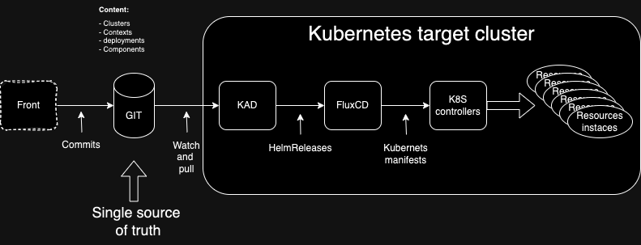

- Sandbox: Integration of Minikube for better cross-OS compatibility: Windows, Linux, etc.
- UI: Exclude the KubeVella option for the following reasons:
  1. No versioning
  2. Packaging does not match
  3. No GitOps
  4. Decreasing trend on GitHub
- Instead, proceed with the following architecture :

1. A REST API development using Go-lang will be necessary between the frontend and the Git layer.
2. The choice of Go-lang is based on the following arguments :
   - [X] Continuity with Kubernetes and existing tools like kubectl
   - [x] Simpler exploitation
   - [x] Modularity
- Unit and integration tests in progress on the Spark authentication module by Orange
